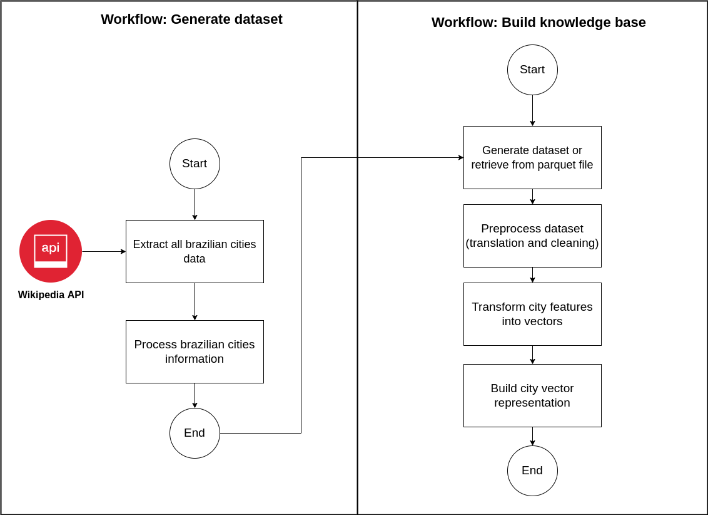
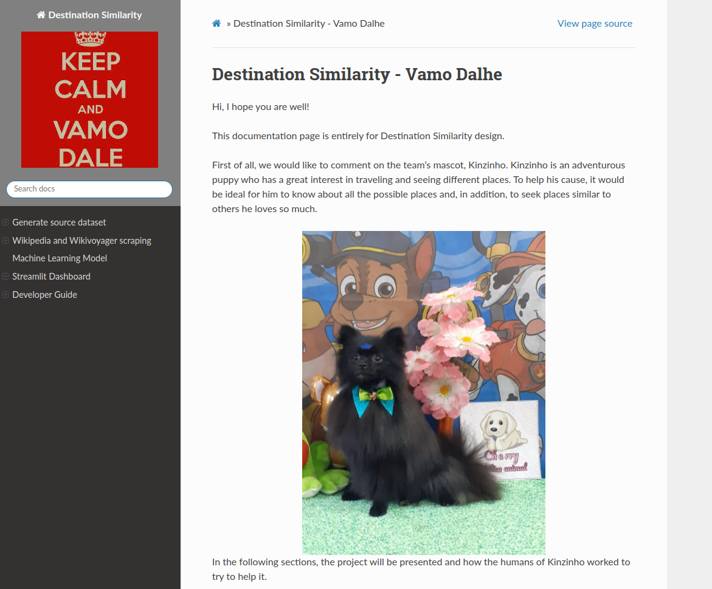

# Destinations Similarity

### Short description

Similar destination search.

### Problem statement

Kinzinho is an adventurous big dog (kkk) who wanted to know about all the destinations he could go to. To do so, Kinzinho needed to extract public data from Wikipedia and Wikivoyager to get to know them all! But now he's realized it's too much and wants some recommendations based on where he's traveled before. Can we help him?

Tip:
Of course! Everything is ‘paw-sible’ when you have a dog :D !!

### Solution implementation

The solution to the problem was to extract the public base of Brazilian cities from Wikipedia and model the relevant characteristics of cities to build a unique representation of each city. From there, we were able to determine the similarities by calculating the distances between the
vector representations.

The flow of workflows implemented in flyte are shown below:

### Detailed solution

**Objective**: To help Kinzinho define his next travel destination, we seek to find other cities similar to the last travel destination he liked the most.

**Strategy Solution**: To make a good evaluation between the cities, we chose to make a vector representation of each city in Brazil, encoding general information about each city such as its history, its geography, its climate and its tourist attractions. We chose this strategy because with a vector representation of the city we were able to apply similarity calculation operations between cities, considering various information about them.

**Input data**: For our solution we use the following data from wikipedia and wikivoyage: "summary_wikipedia_en", "history_wikipedia_pt", "geografia_wikipedia_pt", "clima_wikipedia_pt", "see_wikivoyage_en", "do_wikivoyage_en", "summary_wikivoyage_en"

**Preprocessing**: To process the data and extract only important information, we apply a series of pre-processing to clean unnecessary information and homogenize the texts.

**Model**: To generate the best vector representation of each city's features, we used a pre-trained state-of-the-art model based on Transformers (BERTimbau). As a vector representation of each feature of the city, we use the output of the last layer of the BERTimbau language model. The vector representation of each city is generated from the average of the vectors of its features.

**Similarity**: To calculate the similarity between the vector representations of each city, we are using an high optimized library and calculate the Euclidean distance between an input vector query (vector of the last city visited by Kinzinho) and all vectors of the cities available in our portfolio.

### Streamlit interface

The user interaction interface was built using the streamlit tool. After local testing, the stable version of the tool was posted on Streamlit's public server. You can access the interface through the link below.

### Sphinx docs

> ###### WARNING
> This documentation was built thinking about linux/mac operating systems or executions using WSL.

It is possible to generate detailed HTML documentation of the project through automation made in Sphinx and NGIX server to host the static HTMLs.

There's not much mystery about building the documentation in HTML. We've already automated some things to make it easier. Generally speaking, Sphinx is responsible for creating a static page of HTML documentation using manually typed information or other information inserted into the developed code. These generated static pages are moved into a folder in a container running an NGINX image which hosts the documentation page.

To build the Docker image responsible for the documentation and start hosting the server, just run the command

> ###### WARNING
> For this command to work it is necessary that in your location it is possible to run Makefile files and ensure that the working directory is inside projects/destinations_similarity
    
    make open-docs

Once the command has been successfully executed, you can check with the command below if the container is running normally on your machine.

    docker ps

the result should be

    $ docker ps
    CONTAINER ID   IMAGE     COMMAND                  CREATED          STATUS          PORTS                                   NAMES
    84cb390d977f   nginx     "/docker-entrypoint.…"   36 seconds ago   Up 35 seconds   0.0.0.0:8080->80/tcp, :::8080->80/tcp   sphinx-nginx

### Team responsible for the project

If you want to get in touch with team members, use the communication channels below.

|                	| E-mail                  	| Linkedin                                                   	|
|----------------	|-------------------------	|------------------------------------------------------------	|
| Sergio Junior  	| sergio.junior@hurb.com  	| https://www.linkedin.com/in/sergio-barreto-jr/             	|
| Renata Gotler  	| renata.gotler@hurb.com  	| https://www.linkedin.com/in/renata-gotler/                 	|
| Matheus Moreno 	| matheus.moreno@hurb.com 	| https://www.linkedin.com/in/matheusfmoreno/                	|
| Patrick Braz   	| patrick.braz@hurb.com   	| https://www.linkedin.com/in/patrick-franco-braz-752948163/ 	|

### Acknowledgments

Kinzinho and his humans would like to thank everyone involved who made this project possible. They would also like to thank [Hurb's](https://us.hurb.com/?pos=us) support in allowing and influencing participation in the hackathon as training and recognition of the team's potential. And finally, thank Kinzinho himself for making the days of his humans around better.