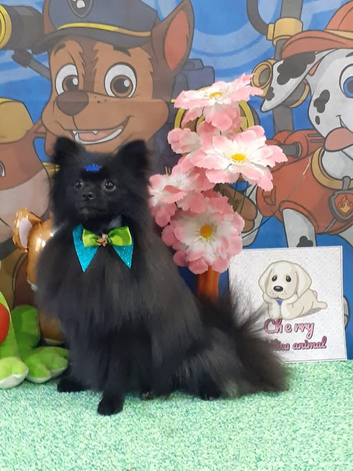
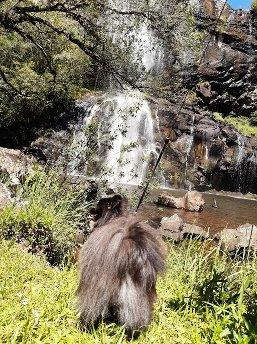
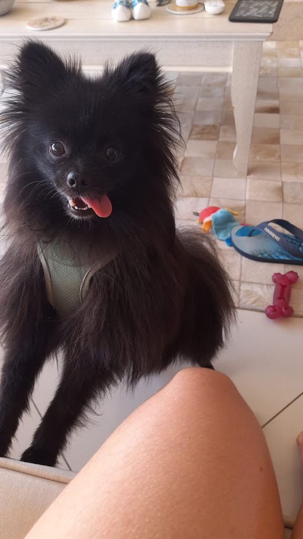

Destination Similarity - Vamo Dalhe
============================

.. toctree::
   :maxdepth: 2

Hi, I hope you are well!

This documentation page is entirely for Destination Similarity design.

First of all, we would like to comment on the team's mascot, Kinzinho. Kinzinho is an adventurous puppy who has a great interest in traveling and seeing different places. To help his cause, it would be ideal for him to know about all the possible places and, in addition, to seek places similar to others he loves so much.

In the following sections, the project will be presented and how the humans of Kinzinho worked to try to help it.

---------------------------

Getting the data
---------------------------

Kinzinho is an adventurous little dog who wanted to know about all the destinations he could go to. Kinzinho had the trouble of having to search for public databases which could be used. It is important to point out that his main focus was Brazil (even because Kinzinho is passionate about nature here). So their humans immediately came up with the idea of using information from Wikipedia and Wikivoyager.

In the links below it is possible to access information from the codes made by Kinzinho's humans to search for all possible destinations in Brazil.

.. toctree::
   :maxdepth: 2

   docs/scraper/scraper
   ...

Machine Learning Model
---------------------------

Kinzinho has so many adventurous options that he had to extract public data on Wikipedia and Wikivoyager to get to know all of them! But he now realized that it is too much and wants some recommendations based on where people traveled before. Can we help him?

Of course! Everything is 'paw-sible' when you have a dog :D !!

.. toctree::
   :maxdepth: 2

   docs/model/model
   ...

Creating a user interface (Streamlit)
---------------------------

Once the similarity inference model is ready, Kinzinho's humans built an interface to help not only him, but everyone interested in being as adventurous as Kinzinho is.

Shall we start the mess? I mean... Travel?

.. toctree::
  docs/dashboard/dashboard

Developer guides (How to)
---------------------------

Kinzinho is not the programming professional. But he asked his humans to leave a minimally detailed description so that evaluators and other Hackathon participants could understand a few things about the project. Access the link below for more details.

.. toctree::
   docs/guides/guide

Project references
---------------------------

* [Wikipedia API] - https://www.wikidata.org/wiki/Wikidata:SPARQL_query_service/queries/examples
* [Calculate vector similarity] - https://github.com/facebookresearch/faiss
* [Translate model] - https://deep-translator.readthedocs.io/en/latest/
* [NLP Model] - https://huggingface.co/neuralmind/bert-base-portuguese-cased
* [Streamlit docs] - https://docs.streamlit.io/
* [Flyte docs] - https://docs.flyte.org/en/latest/
* [Sphinx docs] - https://www.sphinx-doc.org/en/master/

Acknowledgments
---------------------------

Kinzinho and his humans would like to thank everyone involved who made this project possible. They would also like to thank `Hurb's <https://us.hurb.com/?pos=us>`_ support in allowing and influencing participation in the hackathon as training and recognition of the team's potential. And finally, thank Kinzinho himself for making the days of his humans around better.