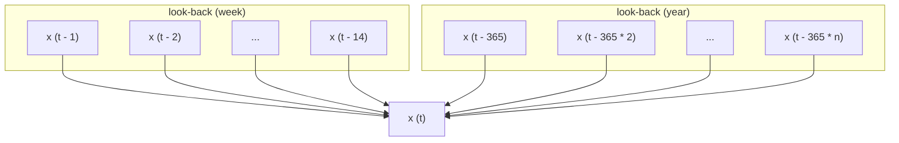

# Weather Forecasting

The purpose of this project is to train a model to perform weather forecasting
using [noaa.gov](https://www.ncei.noaa.gov/) data.

**Note:** _For the best reading experience on github, we recommend installing the_
_[markdown diagrams browser extension](https://github.com/marcozaccari/markdown-diagrams-browser-extension)_
_to render all of the diagrams_ and _[mathjax (chrome)](https://github.com/orsharir/github-mathjax)_
for math rendering.

## Prototype

Since the term "weather forecasting" is quite expansive, we'll scope the protoype
to the problem of next-day mean temperature prediction (MTP) at a set of specified
locations. At a high level, our trained model function should look like:

```python
locations = ["Seattle, WA, USA", "Atlanta, GA, USA", "Hyderabad, India"]
predictions: List[float] = predict_mean_temperature(locations)
```

Where `locations` might be more precisely defined by country, city, zipcode, etc.

### Training Data

For training data, we'll use the [integrated surface database (ISD)](https://www.ncdc.noaa.gov/isd)
to obtain global hourly  weather data.

- [ISD Home page](https://www.ncdc.noaa.gov/isd)
- [Web Browser GUI](https://www.ncei.noaa.gov/access/search/data-search/global-hourly)
- [Web Services API](https://www.ncdc.noaa.gov/cdo-web/webservices/ncdcwebservices)
- [Full ISD Documentation](https://www.ncei.noaa.gov/data/global-hourly/doc/isd-format-document.pdf)


### Training Pipeline

There are several options for training the MTP model:

#### Online Training

Online model that updates its parameters daily based on fixed set of historical data
temperature data (and potentially other related data). For example, for a given day `t`:
- 2-week look back from `t`
- data on the same day as `t` from the last `n` years

The model would estimate the function $x^t = f(x^{t - 1}, ..., x^{t - 14}, x^{t - 365 \times 1}, ... x^{t - 365 \times n})$, where $x_t$ is the mean temperature for a particular day $t$.



#### Offline Training

Offline model trained once on historical data going back `n` years. The data would be
processed in the same form as the online model, it would just have more training instances.

#### Hybrid Training

Combined offline-online model. An offline model can be trained on historical data
and can be updated on a daily basis as new data points are obtained.

### Pipeline Tasks

At a high level, the pipeline should look something like:

```python
for today in days:
    # update the model
    training_instance = get_data_point(today)
    current_model = get_current_model()
    updated_model = update_model(current_model, training_instance)
    write_model(updated_model)

    # get prediction for tomorrow
    tomorrow = today + 1
    prediction_instance = get_data_point(tomorrow)
    mean_temp_tomorrow = updated_model(prediction_instance)
    write_predictions(mean_temp_tomorrow, tomorrow)

    # evaluate trailing performance of the model
    prediction_today = get_prediction(today)  # yesterday's prediction for today
    trailing_performance = evaluate_model(prediction_today, training_instance["mean_temp"])
    write_performance(trailing_performance, today)
```

### Model Architecture

For the prototype, we'll start with a linear regression model using `statsmodel`, which is
able to express a confidence interval of its predictions.

## Extensions

After a prototype is up and running, here are some extensions to make a more sophisticated model:

- perform hourly predictions
- predict other data points such as precipitation
- experiment with other model architectures, like ensembles, to improve performance
- for locations that don't have weather data, interpolate predictions for neighboring areas


## Setup

```
$ make venv
$ source ./.venv/weather-forecasting/bin/activate
$ make deps
$ make env.txt
$ pip install -e .
```

Replace `<API_KEY>` with an [official API key](https://www.ncdc.noaa.gov/cdo-web/token).


## Usage

Export environment variables

```
$ eval $(sed 's/^/export /g' env.txt)
```

Get data
```
python -m flytelab.weather_forecasting.trainer
```


## Streamlit App

To run locally:

```
pip install streamlit
export FLYTE_CREDENTIALS_CLIENT_SECRET=<secret>
streamlit run app/v1/app.py
```


## Resources

Here are some additional resources related to this project:

- [awesome online machine learning](https://github.com/MaxHalford/awesome-online-machine-learning)
- [The correct way to evaluate online machine learning models](https://maxhalford.github.io/blog/online-learning-evaluation/)
-  [Time Series Modeling using Scikit, Pandas, and Numpy](https://towardsdatascience.com/time-series-modeling-using-scikit-pandas-and-numpy-682e3b8db8d1)
