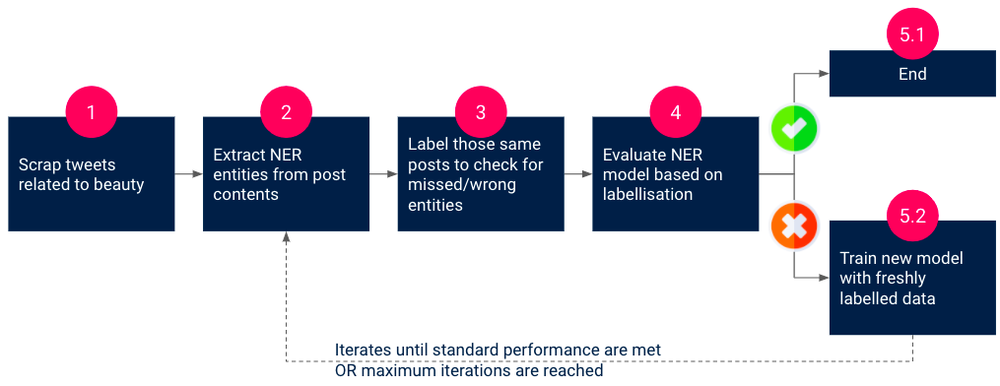
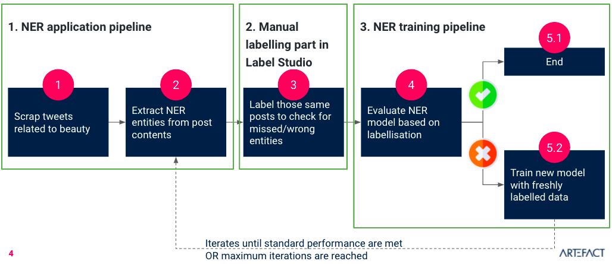
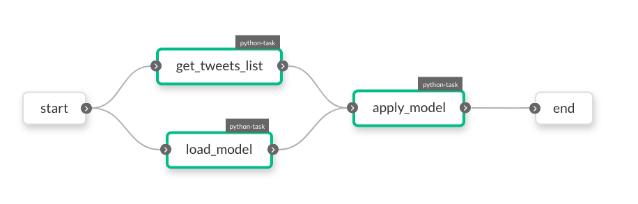
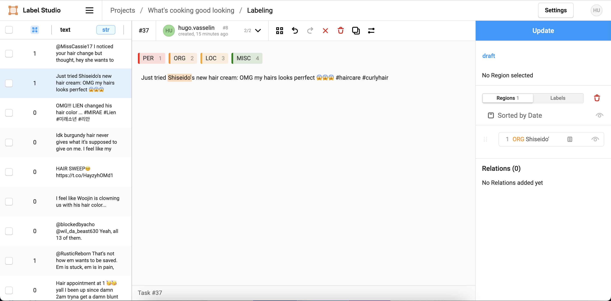
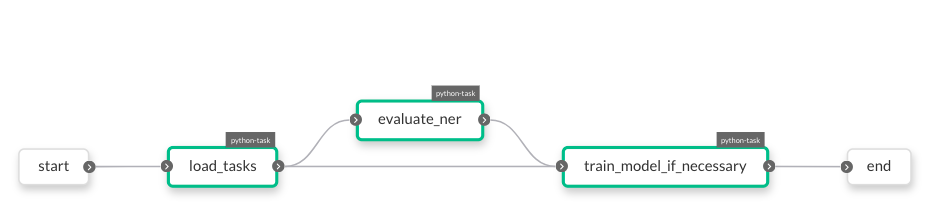

# whats_cooking_good_looking

## Problem statement
The problem is inspired from a past project where we were supposed to extract brands from social media posts.


## Target Solution implementation

<p align="center">
    
</p>

In order to extract brands in a tweet, we implemented a NER (named entity recognition) pipeline that:
1. Retrieves tweets related to beauty based on keywords
2. Applies a pretrained NER model to those posts
3. Sends model results to a labelling interface and waits for a manual annotation to check given results
4. Computes evaluation metrics (so far only accuracy but it would be interesting to compute precision and recall as well)
5. 1. If metrics are good enough (defined by a business standard), the pipeline end
5. 2. If metrics are not good enough, it sends those labeled posts into a training task and goes back into the same piece of pipeline composed of steps 2 - 3 - 4


## Actual Solution implementation

<p align="center">
    
</p>

The project is cut into 3 steps:

### 1. NER application pipeline
1. Retrieves tweets related to beauty based on keywords
2. Applies a NER model to those posts
3. Sends model results in a format that could load into Label Studio in a GCS bucket

To run this pipeline locally please run
```python whats_cooking_good_looking/apply_ner_workflow.py```

<p align="center">
    
</p>

### 2. Manual labelling part in Label Studio

<p align="center">
    
</p>


### 3. NER training pipeline
1. Retrieves labelled tasks (Label Studio output)
2. Computes model accuracy based on those labelled observations
3. 1. If metrics are good enough, pipeline stops
3. 2. If metrics are not good enough, labelled tasks are used as input to train a new NER model

The goal was to create a feedback loop where it was possible to iterate by training NER models based on new manual annotations. We chose to cut into 2 pipelines to get rid of the network constraints that we would have to handle and that were not evaluated in the scope of this hackaton.

To run this pipeline locally please run
```python whats_cooking_good_looking/train_ner_workflow.py```

<p align="center">
    
</p>
## Pipeline deployment

The Goal of this pipeline is deploy workflows automatically to the playground on pushed commits

### Steps and flow
the steps are :
1. Build the dockerfile of our project
2. Push the build docker image to the container registery of our GCP project
3. serialize our workflows using the pyflyte cli
4. register the packages to our playgroud project

Step 3 and 4 are using external docker based github actions that we made ourselves : [serialize](https://github.com/louisRDSC/FlyteSerializeAction), [register](https://github.com/louisRDSC/flyteRegisterAction)

for all branches except main, the workflows are registered in the development environment. For main the workflows are registered in the staging environment. Future iterations could register them in the production evironment when a tag is created.

In develpment each version of a workflow is named like followed : \<branch name\>-\<datetime\>.
This allows ourself to easily recognize our work while working simultaneously on different branches.

In staging each version of a workflow is named like followed : \<datetime\>

### How to make it work

4 secrets are required for the pipeline to work :
- ClIENT_ID : the ID to authenticate with the playground
- ClIENT_SECRET : The secret to authenticate with the playgroud
- RUNNER_KEY : The json key encoded in BASE64 of a GCP service account with read and write rights on the gcp bucket where the data il pulled and pushed from.
- SERVICE_ACCOUNT_KEY : The json key of a service account with write rights on the container registery where we are pushing our images
